# 🌐 LangMastero – Language Learning App

<p align="center">
  
  <br>
  <strong>LangMastero – Learn Languages Easily</strong>
</p>


LangMastero is a cross-platform language learning application. This was built by **Team Quattro** for the 2nd year 2nd semester application development final project. This has been made by using **Flutter** for the frontend, **FastAPI** for the backend, and **MongoDB** for the database. The app offers an engaging and intuitive way to learn new languages and also good for test yourself by attend in exams.

## Attachments

  - [Video](https://youtu.be/-zH8NUaVHFw)
  - [Video (with voice)](https://youtu.be/-zH8NUaVHFw)
  - [Report](App%Development%Report.pdf)
  - [Apk File](https://drive.google.com/file/d/1VICObE5gMyPvmKnrwiV2NgcdLoCO8O8O/view?usp=drive_link)

## 📱 Features

- 🔐 User Authentication (Signup/Login)
- 📚 Vocabulary, Flashcards, MCQ Quiz and Sentence Making.
- 📈 Learning Guideline with Todo List
- 🌍 Support for Multiple Languages
- ☁️ Live QNA with admin (Pro User)
- 📈 Pre recorded premium video classes
- 📊 Admin Dashboard (For insert JSON and manage user)
- 🌐 Web version using Flutter Web
- ☁️ Data stored in MongoDB (Cloud/Local)
- 📦 RESTful API powered by FastAPI

## 🧰 Tech Stack

| Layer                          | Technology         |
|--------------------------------|--------------------|
| Frontend                       | Flutter            |
| Backend                        | FastAPI (Python)   |
| Database                       | MongoDB            |


## **Screens 📸**

|  | 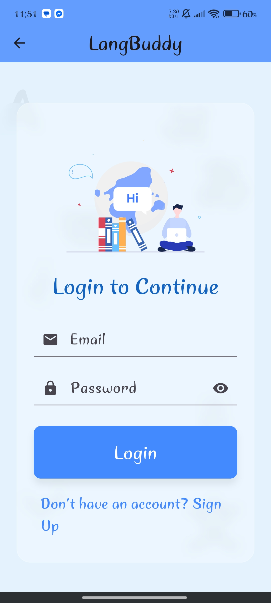 |
|:----------------------------:|:--------------------------:|
|      _Welcome Screen._       |      _Login Screen._       |

| 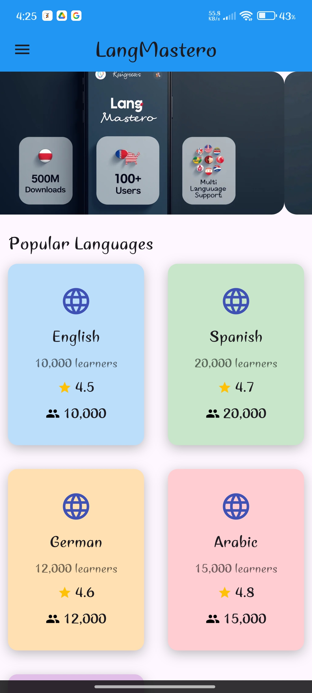 | 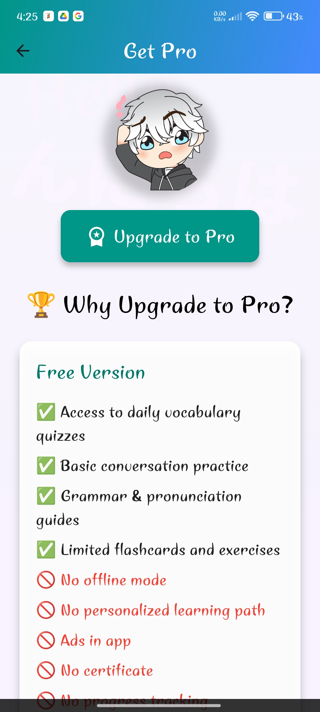 |
|:------------------------:|:-------------------------:|
|      _Home Screen._      |  _Pro purchase Screen._   |

| 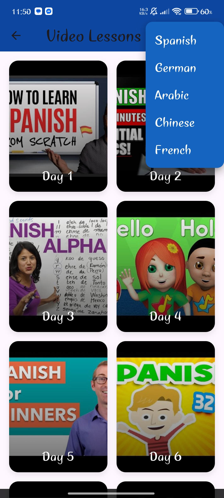 | 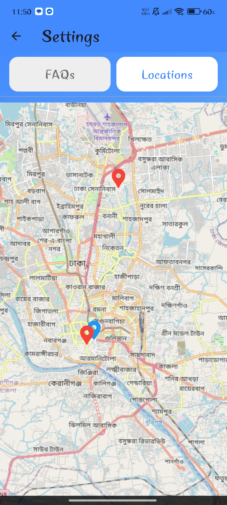 |
|:--------------------------:|:--------------------------------:|
| _Recorded Lecture Screen._ |     _Offline branch Screen._     |

| 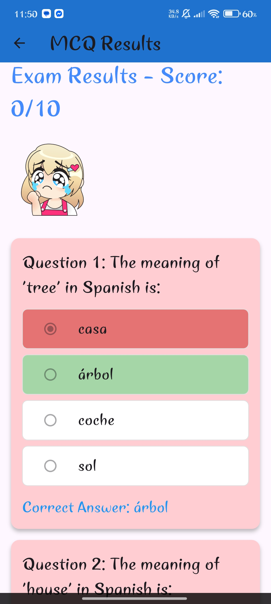 | 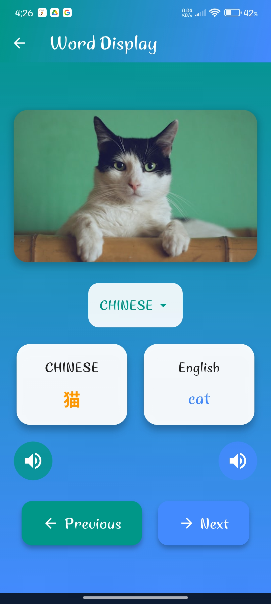 |
|:----------------------:|:------------------------------------:|
|   _MCQ exam Screen._   |         _Vocabulary Screen._         |

| 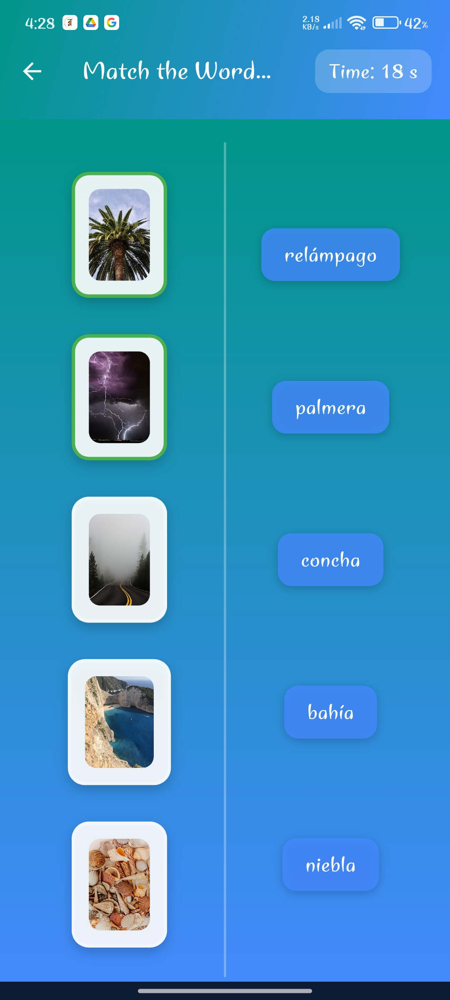 | 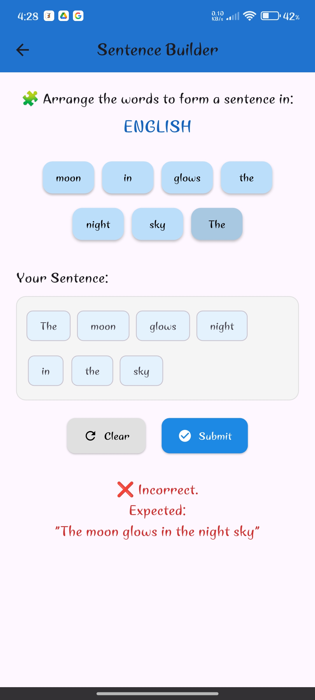 |
|:----------------------------:|:----------------------------------:|
|     _Flash Card Screen._     |     _Sentence making Screen._      |

| 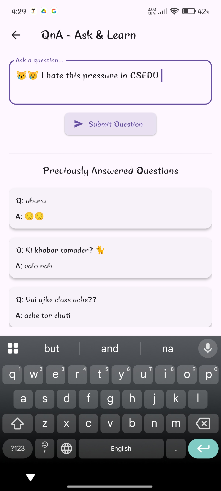 | 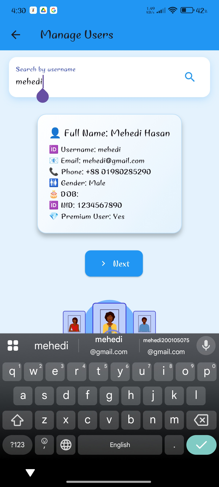 |
|:----------------------:|:------------------------------:|
| _Interaction Screen._  |     _Manage User Screen._      |


--- 
## 🛠️ Getting Started

### Prerequisites

- Flutter SDK (3.x+)
- Python 3.9+
- MongoDB (local or cloud like MongoDB Atlas)

### 🔧 Backend Setup

1. Create a .env file with your ip address and port number
   ```bash
   #BASE_URL=http://<your_machine's_ipv4>:8000
   ```

2. Navigate to the backend directory:
   ```bash
   cd backend
   ```

3. Create a virtual environment:
    ```bash
    python -m venv venv
    source venv/bin/activate  # For Windows: venv\Scripts\activate
    pip install -r requirements.txt
   ```

4. Run backend server:
    ```bash
   cd backend/fastAPI
   uvicorn main:app --reload
   ```
   
5. Run frontend:
    ```bash
   flutter pub get
   flutter run
    ```

## 🚀 Future Improvements
    - 🧠 AI tutor with OpenAI API
    - 📥 Downloadable lessons and offline mode
    - 🧑‍🏫 Tutor marketplace and booking system
    - 🎙️ Speech recognition for pronunciation evaluation


## 🙌 Contributors:
### 👤 Abdullah Ibne Masood
- **Email**: [abdullahibnemasoodr@gmail.com](mailto:abdullahibnemasoodr@gmail.com)
- **GitHub**: [AbdullahIbneMasoodRegan](https://github.com/AbdullahIbneMasoodRegan)

### 👤 Ibna Afra Roza
- **Email**: [ibnaafra-2022015891@cs.du.ac.bd](mailto:ibnaafra-2022015891@cs.du.ac.bd)
- **GitHub**: [Roza-fail](https://www.github.com/Roza-fail)

### 👤 Nafisha Akhter
- **Email**: [nafisha3558@gmail.com](mailto:nafisha3558@gmail.com)
- **GitHub**: [nafisha3588](https://github.com/nafisha3588)

### 👤 Mehedi Hasan
- **Email**: [mehedi-2022415897@cs.du.ac.bd](mailto:mehedi-2022415897@cs.du.ac.bd)
- **GitHub**: [hasan-mehedii](https://www.github.com/hasan-mehedii)
